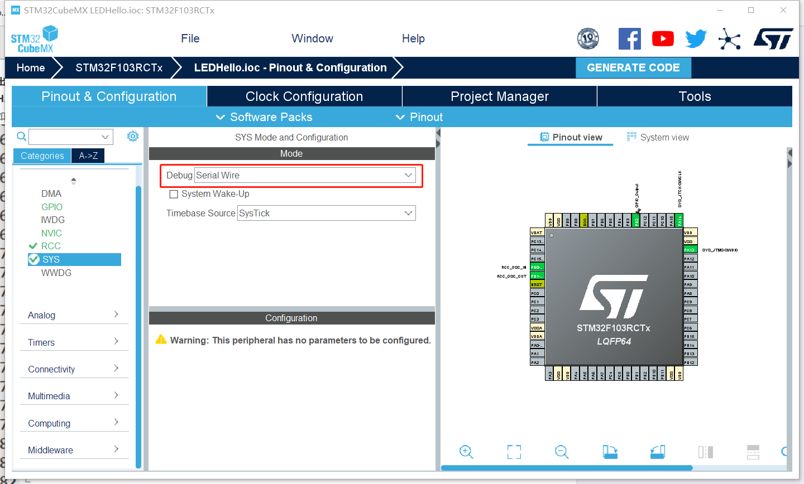
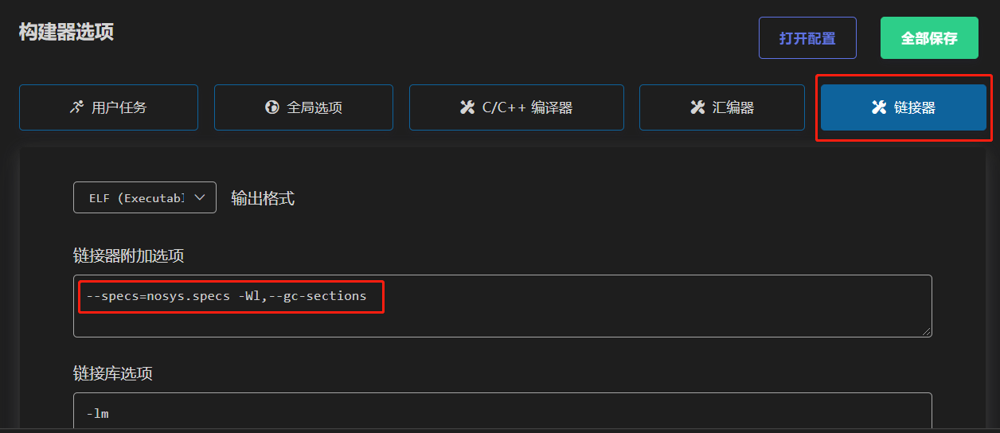
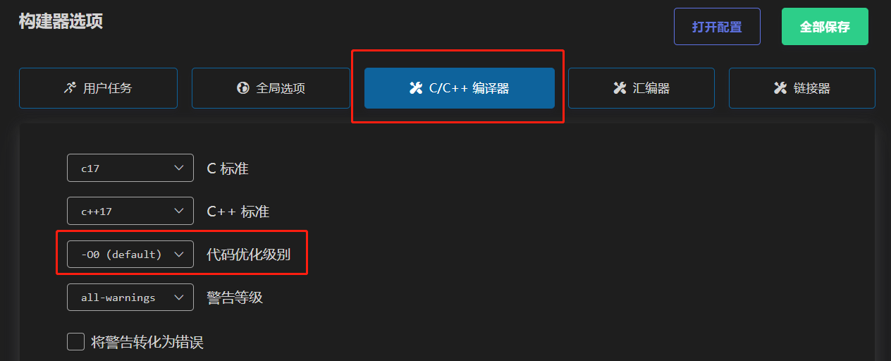
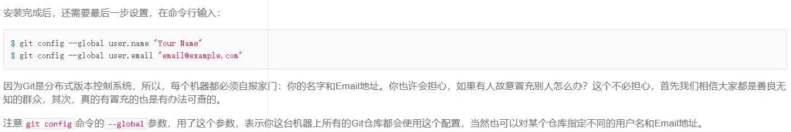

# 资料及注意事项

## 1. 禁止使用No-Debug，会引起无法烧录

<https://www.cnblogs.com/ppl213/p/13934321.html>

## 2. 使用串口输出浮点数(%f)必须设置

## 3. 优化级别调整

## 4. STM32CubeMX防止乱码(中文注释必备)

<https://blog.csdn.net/u011471873/article/details/103024846>

## 5. vscode编译，烧录stm32项目(Embedded IDE 插件)

<https://blog.csdn.net/qq_40833810/article/details/107585306>

需预先准备gcc-arm

## 6. vscode调试stm32项目(Cortex-M 插件)

<https://blog.csdn.net/qq_40833810/article/details/106713462>

需预先准备OpenOCD

## 7. 规则和赛事组的资料

<https://cloud.tsinghua.edu.cn/d/1456725a0f3f4c64bb18/>

讲座链接
STM32 UART串口通信(蓝牙&Zigbee)：https://www.wolai.com/ob1miBxWCHRpH6sTvKoPKC
小车控制&pwm波输出&pid算法：https://foremost-flax-c3a.notion.site/pwm-pid-10-31-6c060f9cccf64eb1863a669dce676818
JY62&编码器测距 Nov. 7th：https://pickled-trombone-62d.notion.site/JY62-Nov-7th-ded99b4b315c4a0f918ffc7871cbd6e7
比赛规则介绍&选手包使用：https://www.wolai.com/mxa73gfwKJ7ZkQjwAmiFGJ

## 8. git教程

* <https://www.liaoxuefeng.com/wiki/896043488029600>\
重点查看“安装git”和“远程仓库”部分

* 这部分user.name和user.email最好和gitee注册的一致\

* <https://blog.csdn.net/zhangshuanlai/article/details/104542309>\
VSCode中的git插件

* 注意gitee使用流程，详见`README.md`

## 9. 在中断里用到的全局变量最好使用volatile修饰
