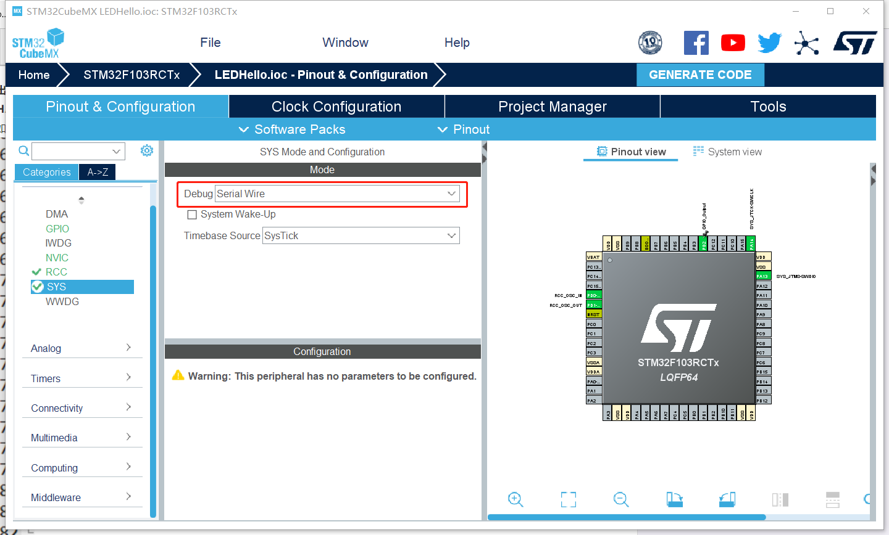
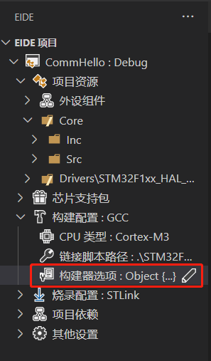
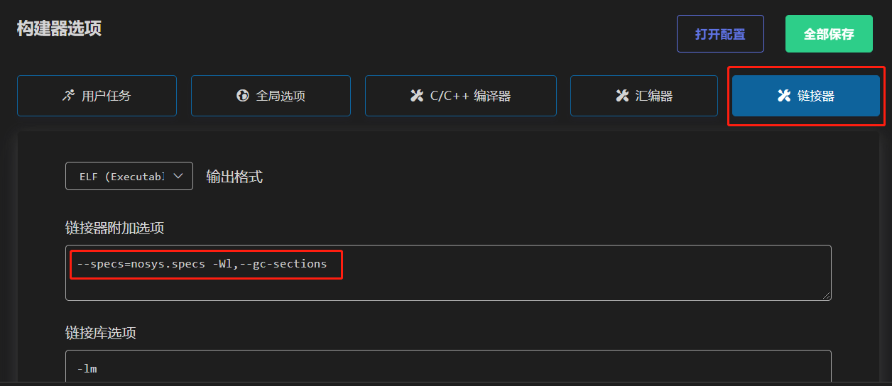
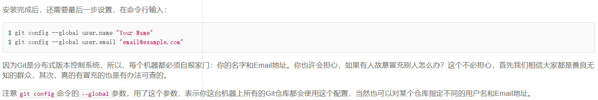

# 资料及注意事项

## 1. 禁止使用No-Debug，会引起无法烧录

<https://www.cnblogs.com/ppl213/p/13934321.html>

## 2. 使用串口输出浮点数(%f)必须设置

## 3. 优化级别调整

## 4. STM32CubeMX防止乱码(中文注释必备)

<https://blog.csdn.net/u011471873/article/details/103024846>

## 5. vscode编译，烧录stm32项目(Embedded IDE 插件)

<https://blog.csdn.net/qq_40833810/article/details/107585306>

需预先准备gcc-arm

## 6. vscode调试stm32项目(Cortex-M 插件)

<https://blog.csdn.net/qq_40833810/article/details/106713462>

需预先准备OpenOCD

## 7. 规则和赛事组的资料

<https://cloud.tsinghua.edu.cn/d/1456725a0f3f4c64bb18/>

## 8. git教程

* <https://www.liaoxuefeng.com/wiki/896043488029600>\
重点查看“安装git”和“远程仓库”部分

* 这部分user.name和user.email最好和gitee注册的一致\

* <https://blog.csdn.net/zhangshuanlai/article/details/104542309>\
VSCode中的git插件

* 注意gitee编辑代码的流程(文件: `README.md`)
