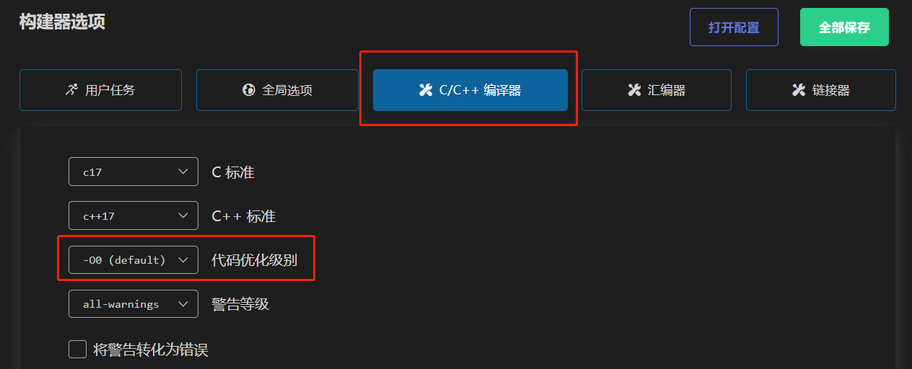

# 资料及注意事项

## 禁止使用No-Debug，会引起无法烧录

<https://www.cnblogs.com/ppl213/p/13934321.html>

## 使用串口输出浮点数(%f)必须设置

## 优化级别调整

## STM32CubeMX防止乱码(中文注释必备)

<https://blog.csdn.net/u011471873/article/details/103024846>

## vscode编译，烧录stm32项目(Embedded IDE 插件)

<https://blog.csdn.net/qq_40833810/article/details/107585306>

需预先准备gcc-arm

## vscode调试stm32项目(Cortex-M 插件)

<https://blog.csdn.net/qq_40833810/article/details/106713462>

需预先准备OpenOCD

## 规则和赛事组的资料

<https://cloud.tsinghua.edu.cn/d/1456725a0f3f4c64bb18/>

## git教程

<https://www.liaoxuefeng.com/wiki/896043488029600>
